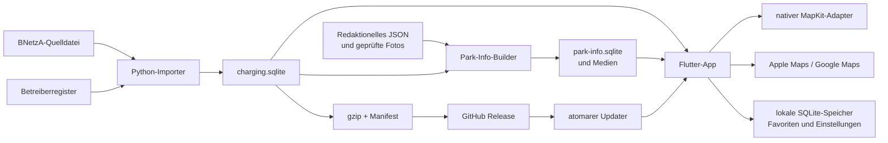

# Technische Übergabe für die Weiterentwicklung

Status: Verbindlicher Einstieg in den verifizierten Projektstand

Stand: 28. August 2026

## 1. Zweck dieses Dokuments

Dieses Dokument ermöglicht einer neuen Entwicklerin, einem neuen Entwickler
oder einer KI ohne Gesprächskontext einen schnellen, aber belastbaren Einstieg.
Es ersetzt weder Anforderungen noch ADRs. Es verbindet den tatsächlichen
Repository-Zustand mit den verbindlichen Detaildokumenten und kennzeichnet
Aussagen als **Ist-Zustand**, **entschieden**, **geplant** oder **offen**.

Bei Widersprüchen gilt diese Reihenfolge:

1. tatsächlicher Code und ausführbare Tests für den implementierten Zustand,
2. Produktanforderungen in
   [`specification/02_Requirements.md`](specification/02_Requirements.md),
3. angenommene ADRs unter [`adr/`](adr/),
4. übrige Spezifikationskapitel,
5. [`PROJECT_STATUS.md`](../PROJECT_STATUS.md) als verifizierte Momentaufnahme,
6. dieses Einstiegsdokument,
7. historische Dateien unter [`archive/`](archive/).

Vor jeder Änderung sind zusätzlich die Arbeitsregeln in
[`AGENTS.md`](../AGENTS.md) vollständig zu lesen.

## 2. Projekt in drei Minuten

Der Ladepark Explorer ist eine offline-first Flutter-App für das iPhone. Sie
stellt nicht einzelne Ladesäulen, sondern räumlich zusammenhängende Gruppen
öffentlich zugänglicher Ladeinfrastruktur in Deutschland dar. Nutzende können
selbst festlegen, was ein geeigneter Ladepark ist: Gruppendurchmesser, Zahl und
Mindestleistung der Ladepunkte, Betreiber, Anschlüsse, 24/7-Zugänglichkeit,
Infrastruktur, Umkreis und Favoriten sind kombinierbar.

**Ist-Zustand:** M0 bis M12 (Version 1.0) sind implementiert. Die App besitzt
eine native MapKit-Karte, lokalen SQLite-Datenzugriff, Suche, Standort, Filter
(seit 1.1 über einen Neustart erhalten), Details, Favoriten, eigene
Vor-Ort-Informationen und Fotos, Apple-/Google-Maps-Übergabe, Deutsch/Englisch,
statische verifizierte Datensatzupdates und eine bewusste No-Telemetry-
Entscheidung. Der erste Datensatz `2026.07.0` ist öffentlich als GitHub
Release verfügbar.

Zusätzlich ist **Version 1.1 („Routen-Update“) funktional eingefroren**
(App-Version `1.1.0`): die Meilensteine M14, M15, M16 und M19 sind
implementiert und auf Simulator und echtem iPhone manuell abgenommen. Die App
plant eine Autoroute A→B, sucht Ladeparks im Korridor, nimmt manuell gesetzte
Ladestopps auf, färbt die Route nach geschätztem Ladezustand (grün → gelb →
rot, Neustart bei Grün je Stopp) und übergibt die Route an Apple Maps oder
Google Maps.

**Nächster verbindlicher Schritt (Version 1.0):** M13 – Release-Härtung und
App-Store-Vorbereitung. TestFlight wurde bewusst noch nicht begonnen.

**Fortsetzung der Routenplanung (Version 1.2):** M17 (automatischer
Ladestopp-Vorschlag mit Lademenge, Ladezeit, Gesamtreisezeit) und M18
(Alternativen, adaptive Neuplanung, Sperren) bleiben in
[`specification/17_Route_Planning.md`](specification/17_Route_Planning.md)
(`FR-ROUTE-007` bis `FR-ROUTE-010`) spezifiziert, sind aber nicht Teil des
1.1-Stands. Die Schnittstellen `ChargingModel`/`StopPlanner` (ADR-0020) sind
dafür bereits vorhanden. Siehe Abschnitt 10.4.

**Nicht Bestandteil von 1.0:** Benutzerkonten, Community-Inhalte,
Live-Belegung, Preise, Bezahlung, ein dauerhaftes fachliches Backend, Android-
Veröffentlichung und eine eigene Turn-by-Turn-Navigation.

## 3. Empfohlener Einstieg für eine neue KI

1. [`../PROJECT_STATUS.md`](../PROJECT_STATUS.md) lesen.
2. Dieses Dokument vollständig lesen.
3. [`README.md`](README.md),
   [`specification/01_ProjectVision.md`](specification/01_ProjectVision.md),
   [`specification/02_Requirements.md`](specification/02_Requirements.md) und
   die für die konkrete Aufgabe relevanten Kapitel lesen.
4. Betroffene ADRs vollständig lesen. Offene Entscheidungen nicht still
   treffen.
5. Mit `git status --short --branch`, `rg --files` und gezielten Tests den
   tatsächlichen Zustand prüfen.
6. Vor Implementierung betroffene Requirement-IDs benennen. Neue
   Architekturentscheidungen zuerst als ADR dokumentieren.
7. Code, Tests, Spezifikation und `PROJECT_STATUS.md` in derselben
   Arbeitseinheit aktualisieren.

Die Definition of Done und alle verbindlichen Prüfkommandos stehen in
[`../AGENTS.md`](../AGENTS.md).

## 4. Repository-Landkarte

| Pfad | Verantwortung | Veröffentlichung |
| --- | --- | --- |
| `app/` | Flutter-App, native iOS-Adapter, App-Tests | Quellcode öffentlich |
| `importer/` | Python-Pipeline, Reviewwerkzeuge, SQLite- und Release-Build | Quellcode öffentlich |
| `contracts/` | ausführbare, sprachübergreifende Datensatzverträge | kleine Fixtures öffentlich |
| `editorial/park_info/` | geprüfte Pflegequelle eigener Standortinformationen | JSON öffentlich; Originalfotos nicht in Git |
| `tooling/` | reproduzierbare Vorbereitung und Qualitätsprüfungen | öffentlich |
| `docs/specification/` | verbindliche Produkt- und Systemspezifikation | öffentlich |
| `docs/adr/` | langfristige Architekturentscheidungen | öffentlich |
| `docs/archive/` | historischer Kontext, ausdrücklich nicht verbindlich | öffentlich |
| `data/raw/` | lokale BNetzA-Rohdaten | git-ignoriert |
| `data/output/` | lokale Berichte, SQLite- und Releaseartefakte | git-ignoriert; ausgewählte Artefakte als GitHub Release |
| `app/assets/generated/` | lokal vorbereiteter Produktbestand und Medien | git-ignoriert |

Das Repository ist öffentlich sichtbar, räumt aber derzeit keine allgemeinen
Nutzungsrechte am eigenen Code, an der Dokumentation oder an redaktionellen
Inhalten ein. Drittquellen behalten ihre eigenen Lizenzen; maßgeblich ist
[`specification/15_License_Compliance.md`](specification/15_License_Compliance.md).

## 5. Systemarchitektur



### 5.1 Architekturprinzipien

- **Offline-first:** Karte benötigt Apple-Kartendienste, aber Suche im
  Ladebestand, Filter, Details und Favoriten arbeiten lokal.
- **Kein fachliches Backend in 1.0:** Verteilung erfolgt über statische,
  unveränderliche Releaseartefakte.
- **Lizenzsichere Trennung:** BNetzA-Ladebestand, mögliche spätere OSM-Daten und
  eigene redaktionelle Inhalte bleiben getrennte Artefakte.
- **Stabile Identitäten:** UUIDv5-IDs und Stationsanker erhalten Referenzen über
  Neubuilds und Gruppendurchmesser hinweg, soweit die Quelle dies zulässt.
- **Dynamische Gruppen statt behaupteter Parks:** Version 1.0 berechnet
  Complete-Linkage-Abstandsgruppen für 25, 50, 100, 200 und 300 Meter. Straßen,
  Zufahrten und Grundstücksgrenzen werden nicht interpretiert.
- **Ports vor Plattformcode:** Flutter-Domaincode kennt Repository- und
  Adapterverträge, aber weder SQLite, Swift noch Presentation-Code. Eine
  Architekturprüfung schützt diese Richtung.
- **Getrennte Lebenszyklen:** Der read-only Ladebestand kann aktualisiert
  werden; Favoriten und Einstellungen bleiben in eigenen schreibbaren
  Datenbanken; redaktionelle Inhalte bleiben unabhängig gebündelt.

Die vollständige Begründung steht in
[`specification/03_System_Architecture.md`](specification/03_System_Architecture.md)
und ADR-0001 bis ADR-0018.

### 5.2 Flutter-Schichten

```text
lib/
├── app/                       Composition Root und Theme
├── features/
│   ├── explorer/              Karte, Suche, Filter und Details
│   ├── favorites/             Modell, Zustand und Favoritenliste
│   ├── park_info/             redaktionelle Informationen
│   ├── dataset_update/        Manifest- und Updatezustand
│   ├── route_planning/        Route, Korridor, Fahrzeugprofil, Ladezustand (1.1)
│   └── settings/              Sprache, Navigation, Updates, Datenschutz
├── data/
│   ├── charging/              read-only SQLite im Hintergrund-Isolate
│   ├── favorites/             lokaler schreibbarer SQLite-Speicher
│   ├── park_info/             getrennter read-only Informationsbestand
│   ├── dataset_update/        HTTP-Quelle und atomare Installation
│   └── settings/              versionierter lokaler SQLite-Speicher
├── platform/
│   ├── maps/                  plattformneutraler Vertrag und MapKit-Kanal
│   ├── route/                 MKDirections-Adapter für den RoutePlanningService (1.1)
│   ├── search/                MKLocalSearch
│   ├── inbound/               eingehende Koordinaten/Deep Link
│   └── navigation/            Apple-/Google-Maps-Adapter, Routenübergabe (1.1)
└── l10n/                      deutsche und englische Ressourcen
```

Riverpod ist Composition Root und Zustandsverwaltung. Direkter `sqlite3`-
Zugriff läuft für den großen Ladebestand in einem langlebigen Isolate. Eine
Kartenabfrage liefert höchstens 500 kompakte Gruppen; Details werden erst nach
Auswahl geladen.

### 5.3 Native MapKit-Grenze und wichtige Stabilitätserkenntnis

Die Karte ist ein app-lokaler UIKit Platform View mit `MKMapView`. Bounds,
Markerauswahl, Standort und Kartenbefehle laufen über kleine Method Channels.
Markerupdates sind differenziell; native Cluster verdichten nur die Anzeige und
sind niemals fachliche `proximity_group`s.

Eine frühe Version fror reproduzierbar nach wiederholtem Öffnen einer
Flutter-Überlagerung über dem Platform View ein. SQLite und Detaildaten waren
nicht die Ursache. Die angenommene Lösung aus ADR-0011 ist eine vollständig
deckende, opake Flutter-Route ohne Übergangsanimation. Diese Grenze darf nicht
beiläufig zurückgebaut werden. Auch Filter, Suche und weitere Vollbildansichten
folgen diesem Muster.

Karten- und Markerarbeit verwendet Debounce, Abfragerand, Revisionen und
Latest-wins-Koaleszierung. Es darf höchstens eine relevante SQLite-Abfrage und
ein natives Markerupdate gleichzeitig laufen.

## 6. Datenmodell und Datenpipeline

### 6.1 Fachliche Hierarchie

```text
station (physische Ladesäule laut Quelle)
└── evse (eigenständig nutzbarer Ladepunkt)
    └── connector (physischer Anschluss)

proximity_group (berechnete räumliche Gruppe je Datensatz und Durchmesser)
└── proximity_group_member → station
```

Eine „Station“ ist nicht mit einem „Ladepunkt“ gleichzusetzen. Filter und
Detailmatrix zählen überwiegend EVSEs. Die gekoppelte Standardbedingung lautet:
mindestens 20 Ladepunkte, von denen jeder mindestens 100 kW erreicht.

Betreiberidentitäten werden nicht heuristisch vereinigt. Nur manuell geprüfte
exakte Aliase in `importer/config/operators.json` erhalten eine kanonische
Identität; alle übrigen Quellnamen bleiben sichtbar und durchsuchbar.

### 6.2 Reproduzierbarer Build

1. BNetzA CSV/XLSX lokal unter `data/raw/` ablegen.
2. Quelle inspizieren und normalisieren.
3. Betreiber- und Cluster-Review bei Bedarf durchführen.
4. Alle fünf Gruppierungsvarianten berechnen.
5. Schema-v2-SQLite atomar schreiben und validieren.
6. Produktbestand mit `tooling/prepare_app_dataset.sh` in die App kopieren.
7. Redaktionellen Bestand mit `tooling/prepare_park_info_dataset.sh` bauen.
8. Für Updates deterministisches gzip und Manifest erzeugen.
9. Unveränderliche Dateien als GitHub Release veröffentlichen.

Der aktuelle Produktbestand hat die Version `2026.07.0`, Schema 2 und stammt
aus dem BNetzA-Snapshot vom 7. Juli 2026. Das Releasearchiv besitzt
182.274.446 Byte; das unkomprimierte SQLite-Artefakt 441.950.208 Byte.

### 6.3 Gemeinsamer Vertrag

`contracts/charging_dataset/v2/` ist die aktuelle ausführbare Schnittstelle
zwischen Python-Produzent und Flutter-Konsument. Änderungen an bestehenden
Tabellen, Metadaten oder Abfragesemantiken sind wie API-Änderungen zu behandeln.
Inkompatible Änderungen benötigen eine neue Vertrags- und Schemaversion; alte
App-Versionen dürfen nicht stillschweigend inkompatible Updates erhalten.

### 6.4 Redaktionelle Vor-Ort-Daten

Eigene Angaben zu Restaurant, Shop, Kaffeeautomat, Snackautomat und Toilette
verwenden die drei Zustände `present`, `absent` und `unknown`, ein
Erhebungsdatum und stabile Stationsreferenzen. Eigene Fotos werden vor dem
Build geprüft, auf 1600 × 1200 Pixel optimiert und von EXIF-/GPS-Daten befreit.
Der erste Bestand umfasst Emstek, Hilden und Kamen mit sechs Fotos.

Originalfotos gehören nicht in Git. Pflegevertrag und Arbeitsablauf stehen in
[`../editorial/park_info/README.md`](../editorial/park_info/README.md).

## 7. Implementierter Funktionsstand

| Meilenstein | Status | Ergebnis |
| --- | --- | --- |
| M0 | implementiert | Toolchain, Flutter-Gerüst und Projektstruktur |
| M1 | implementiert | ausführbare App-Shell und erster iOS-Simulatorlauf |
| M2 | implementiert | Schema-v2-Vertrag und read-only SQLite-Repository |
| M3 | implementiert | native MapKit-Karte, Bounds, Marker und Detailfluss |
| M4 | implementiert | Deutschlandbestand, native Cluster, Details und stabile Karteninteraktion |
| M5 | implementiert | gekoppelte Ladefilter, Betreiber- und Connectorauswahl |
| M6 | implementiert | Ort-/Adress-/Koordinatensuche, eigener Standort und Umkreis |
| M7 | implementiert | lokale Favoriten, Liste, Filter und Herzmarker |
| M8 | implementiert | eigener Informationsbestand und geprüfte Fotos |
| M9 | implementiert | Infrastruktur-, Umkreis- und konservativer 24/7-Filter |
| M10 | implementiert | DE/EN, Einstellungen und Apple-/Google-Maps-Navigation |
| M11 | implementiert | statische, verifizierte und atomare Datensatzupdates |
| M12 | implementiert | keine Telemetrie; transparente lokale Diagnose und Netzwerkgrenzen |
| M13 | geplant | Release-Härtung, TestFlight und App-Store-Vorbereitung |
| M14 (1.1) | implementiert und abgenommen | Basisroute A→B, natives Overlay, Distanz/Fahrzeit, Alternativen |
| M15 (1.1) | implementiert und abgenommen | Korridorsuche als Kartenmarker (einstellbare Breite), manuelle Ladestopps, Teilstrecken-Neuberechnung |
| M16 (1.1) | implementiert und abgenommen | Fahrzeugprofil, Segmentmodell, `EnergyModel`, farbige Ladezustandsroute mit Neustart bei Grün je Stopp, Start-SoC und Ladeziel einstellbar |
| M19 (1.1) | implementiert und abgenommen | Routenübergabe an Apple Maps (ganze Kette) bzw. Google Maps (nächster Stopp) |
| M17 (1.2) | geplant | `ChargingModel`, `StopPlanner`, automatischer Ladestopp-Vorschlag mit Ladezeit und Gesamtreisezeit |
| M18 (1.2) | geplant | Alternativen, adaptive Neuplanung, Sperren vorgelagerter Stopps |

Details und Requirement-Zuordnung stehen in
[`specification/14_Roadmap.md`](specification/14_Roadmap.md),
[`specification/17_Route_Planning.md`](specification/17_Route_Planning.md) und
[`specification/11_Testing.md`](specification/11_Testing.md).

### 7.1 Anforderungsabdeckung und verbleibende Lücken

**Implementiert:** `FR-MAP-001/002`, `FR-GROUP-001`, `FR-SEARCH-001/002`,
`FR-FILTER-001/002/003` (die Auswahl bleibt seit 1.1 über einen Neustart
erhalten), `FR-DETAIL-001`, `FR-NAV-001`, `FR-FAV-001`,
`FR-DATA-001/002/003/004`, `FR-I18N-001` und `FR-PRIV-001` besitzen
Implementierungen und automatisierte Nachweise in unterschiedlicher Tiefe.
Für Version 1.1 sind zusätzlich `FR-ROUTE-001` bis `FR-ROUTE-006` und
`FR-ROUTE-011` sowie `NFR-ROUTE-OFFLINE-001`, `NFR-ROUTE-EXT-001` und
`NFR-ROUTE-PRIV-001` implementiert und mit automatisierten Tests belegt.
`FR-ROUTE-007` bis `FR-ROUTE-010` (M17/M18, Version 1.2) und die formale
`NFR-ROUTE-PERF-001`-Messung sind noch offen.

**Teilweise beziehungsweise vor Release offen:**

- `FR-LINK-001` ist eine Soll-Anforderung. Tabellen und Lizenzregeln für
  offizielle Betreiber-/Standortlinks existieren, aber es gibt noch keine
  kuratierten Produktdatensätze und keine App-Darstellung. M13 muss Umsetzung
  oder begründete Verschiebung entscheiden.
- `NFR-PERF-001` ist durch Abfrageprototypen und Stabilisierung vorbereitet;
  die formale Messung auf der endgültigen Gerätematrix fehlt.
- `NFR-ACCESS-001` ist in der UI berücksichtigt, aber VoiceOver, Dynamic Type,
  Kontrast und Bedienziele benötigen die vollständige M13-Abnahme.
- `NFR-OFFLINE-001` gilt für die lokalen Kernfunktionen. Apple-Kartenbild,
  freie Online-Ortssuche, Navigation und Updateprüfung bleiben externe
  Onlinedienste und benötigen klare Abnahmeszenarien.
- Der M8-Bildpfad ist manuell geprüft; ein automatisierter
  Bilddarstellungstest bleibt offen.
- Google-Maps-Fallback, kompletter Sprachwechsel und mehrere
  Standortberechtigungsszenarien sind auf echtem iPhone noch vollständig
  abzunehmen.

## 8. Lokale Laufzeitdaten

| Bestand | Schreibbarkeit | Lebenszyklus |
| --- | --- | --- |
| gebündeltes `charging.sqlite` | read-only | Basisbestand im App-Bundle |
| heruntergeladenes `charging.sqlite` | nach Installation read-only | versionierte Verzeichnisse; aktuelle und vorherige Version bleiben |
| `park-info.sqlite3` und Medien | read-only | derzeit mit der App gebündelt |
| Favoritendatenbank | read/write | Application Support, unabhängig vom Ladebestand |
| Einstellungsdatenbank | read/write | Application Support, schema-versioniert |

Der Updater prüft Manifestformat, HTTPS-URL, kompatible App- und Schemaversion,
komprimierte und unkomprimierte Größe und SHA-256, `PRAGMA integrity_check` und
Metadaten. Erst danach ersetzt ein atomarer `active.json`-Zeiger den aktiven
Bestand. Ein Fehler verändert den bisherigen Bestand nicht.

## 9. Entwicklung und Verifikation

### 9.1 App mit Produktdaten starten

```text
./tooling/prepare_app_dataset.sh
./tooling/prepare_park_info_dataset.sh
./tooling/run_ios_simulator.sh
```

Ohne generierte Produktdaten verwendet die App bewusst kleine Contract-
Fixtures. Ein erfolgreicher Start mit Berlin-/München-Testdaten beweist deshalb
nicht, dass der vollständige Deutschlandbestand eingebunden ist.

### 9.2 Qualitätsgates

Importer:

```text
cd importer
uv sync
uv run pytest
uv run ruff check .
uv run ruff format --check .
uv run mypy src
```

Flutter:

```text
cd app
flutter pub get
flutter gen-l10n
dart format --set-exit-if-changed lib test
flutter analyze
flutter test
dart run ../tooling/check_flutter_architecture.dart
flutter build ios --simulator
```

Dokumentation:

```text
python3 tooling/check_markdown_links.py
git diff --check
```

Zuletzt verifiziert: 72 Importertests und 115 Flutter-Tests; `dart format
--set-exit-if-changed`, Flutter-Analyse, Architekturprüfung, Markdownlinks,
`git diff --check` und der iOS-Simulator-Build waren erfolgreich, ebenso Ruff,
Mypy und die Importer-Tests. Der vollständige manuelle Produktlauf wurde auf
einem iPhone-16-Simulator ausgeführt; die Routenplanung von Version 1.1 wurde
zusätzlich auf einem echten iPhone abgenommen. Die öffentlichen
GitHub-Actions-Läufe von `main` bis Commit `fb49f22` waren erfolgreich; die
Version-1.1-Arbeit lag bis zum Einfrieren auf einem Featurebranch.

## 10. Roadmap und Zukunftsfähigkeit

### 10.1 Version 1.0 – verbleibend

M13 umfasst keine neue große Fachfunktion. Er schließt Performance- und
Offlineabnahme, Zugänglichkeit, Lizenz- und Datenschutznachweise,
App-Store-Metadaten, Signierung, TestFlight, Gerätematrix und finale
Releasechecks ab. Eine kryptografische Manifest-Herkunftssignatur ist noch zu
entscheiden; SHA-256 im selben Manifest schützt Integrität, nicht Herkunft.

### 10.2 Version 1.5 – redaktionell und gemeinschaftlich

**Geplant, aber noch nicht spezifiziert:** breiterer Foto-/Informationsbestand,
Feedback, Bewertungen, Kommentare, Betreiber-/Redaktionsregeln, bestätigte
`verified_park`-Objekte, Statistiken, Top-Listen, Benutzerkonten und Moderation.
Android ist ebenfalls erst nach erfolgreichem iPhone-Start vorgesehen.

Die Architektur bereitet dies vor durch stabile Stations- und Betreiber-IDs,
die Trennung von berechneten Gruppen und bestätigten Parks, getrennte
redaktionelle Artefakte, Repository-Grenzen und eine plattformneutrale
MapAdapter-Schnittstelle. Noch nicht entschieden sind Backend, Authentisierung,
Moderationsmodell, Konfliktauflösung und Android-Kartenversorgung.

### 10.3 Version 2.0 – Live-Daten und Preise

**Idee:** Live-Belegung, Tarife, Preise und eventuell Ladeanbieterintegration.
Diese Funktionen benötigen neue Datenquellen, Aktualitäts- und
Ausfallsemantik, wahrscheinlich ein Backend und eine eigene Lizenz- und
Datenschutzprüfung. PostgreSQL/PostGIS, Redis und FastAPI sind nur
Technologiekandidaten, keine Entscheidung.

### 10.4 Routenplanung – Version 1.1 („Routen-Update“) und Version 1.2

**Version 1.1 ist funktional eingefroren (App-Version `1.1.0`).** Verbindlich in
[`specification/17_Route_Planning.md`](specification/17_Route_Planning.md)
(`FR-ROUTE-001` bis `FR-ROUTE-011`, `NFR-ROUTE-*`) und in ADR-0019 bis
ADR-0023. Version 1.1 ergänzt Version 1.0 um die Routenplanung; sie ist von
M13 unabhängig.

Umgesetzt und manuell abgenommen:

- **M14** – Online-Autoroute A→B über Apple `MKDirections`, nativ als Overlay
  in `MKMapView`, mit Distanz/Fahrzeit und Alternativrouten.
- **M15** – lokale Korridorsuche unter den aktiven Filtern (Abtastung der
  dezimierten Polyline mit der bestehenden Radiusabfrage, ADR-0022; die
  Korridorbreite ist je Fahrt einstellbar), Ladeparks als Kartenmarker,
  manuell gesetzte Ladestopps mit Neuberechnung der Teilstrecken.
- **M16** – lokales Fahrzeugprofil in den Einstellungen (ADR-0021),
  Segmentmodell und `EnergyModel` (ADR-0020), `TripEnergySimulator`, farbige
  Ladezustandsroute (ADR-0023) mit Neustart bei Grün nach jedem Stopp;
  Start-Ladezustand und Ladeziel am Stopp sind je Fahrt einstellbar.
- **M19** – Übergabe der geplanten Route an eine Navigations-App (ADR-0016
  Nachtrag): Apple Maps erhält die ganze Kette über `MKMapItem.openMaps`,
  Google Maps wird über `comgooglemaps://` zum nächsten Ladestopp geführt, da
  das Schema keine Wegpunktkette kennt.
- **FR-FILTER-001** – die Kartenfilter überleben seit 1.1 einen App-Neustart
  (JSON im Einstellungsspeicher, Vertrag `ExplorerFiltersRepository`).

**Version 1.2 – noch offen:** M17 (`ChargingModel`, `StopPlanner`,
automatischer Ladestopp-Vorschlag mit Lademenge, Ladezeit und
Gesamtreisezeit) und M18 (Alternativenauswahl, adaptive Neuplanung, Sperren
vorgelagerter Stopps). `FR-ROUTE-007` bis `FR-ROUTE-010`. Die Verträge
`ChargingModel` und `StopPlanner` sind in ADR-0020 entschieden;
`TripEnergySimulator` nimmt den Abfahrt-Ladezustand bereits über einen
Rückruf entgegen.

Der plattformneutrale Vertrag heißt `RoutePlanningService`
(`features/route_planning/domain/`); die MapKit-Implementierung liegt unter
`platform/route/`, die Routengeometrie als Overlay im nativen View. Exakte
Apple-Polylines werden nicht über den Method Channel transportiert; Flutter
erhält nur eine dezimierte Polyline und Kennzahlen. Start, Ziel und
Zwischenziele werden an Apple übertragen und sind in der
Datenschutzdokumentation ergänzt. Die austauschbaren Modellschnittstellen
halten die spätere „intelligente“ Vorhersage (Straßenart, Steigung,
Temperatur, Ladekurve, Fahrergewohnheiten) nachrüstbar.

### 10.5 Weitere bewusst vorbereitete Erweiterungen

- **OSM-Infrastruktur:** getrenntes ODbL-Artefakt statt Vermischung mit BNetzA.
- **Share Extension/Deep Links:** eingehende Koordinaten sind bereits hinter
  einem Adapter gekapselt; ein standardisierter Rückweg aus fremden Karten-Apps
  wird nicht behauptet.
- **Andere Updateinfrastruktur:** HTTP-Quelle und Manifestvertrag kapseln
  GitHub; ein Wechsel zu R2/S3 ist ohne Änderung der Fachlogik möglich.
- **Android:** Domain-, Repository- und Kartenverträge sind plattformneutral;
  der heutige native MapKit-Adapter wird nicht wiederverwendet.
- **Backend:** Die lokale App bleibt Konsument klarer Verträge; Community- und
  Live-Daten können später als getrennte Komponenten hinzukommen.

Die priorisierte und statusmarkierte Gesamtliste steht in der
[`specification/14_Roadmap.md`](specification/14_Roadmap.md).

## 11. Bekannte Risiken und offene Entscheidungen

- M13 muss reale Performance, Speicherbedarf, Offlinezustände, Dynamic Type,
  VoiceOver, Kontrast und mehrere iPhone-Größen abnehmen.
- Die Herkunftssignatur für Datensatzmanifeste ist offen.
- Ein späteres OSM-Artefakt benötigt konkreten Anbieter, Attribution,
  ODbL-Nachweise und Hostingentscheidung.
- BNetzA-Schema und Webservice können sich ändern; der Importer muss Schema-
  Drift weiterhin hart erkennen.
- Fehlende oder doppelte EVSE-IDs begrenzen die Stabilität einzelner
  Ladepunktidentitäten.
- `proximity_group` ist datensatz- und durchmesserabhängig. Dauerhafte
  Benutzerreferenzen dürfen nicht ausschließlich eine Gruppen-ID speichern.
- TestFlight und App Store benötigen kostenpflichtige Apple-Mitgliedschaft,
  endgültige Signierung, öffentliche Datenschutz-URL und Metadaten.
- TestFlight stellt eigene Sitzungs-/Crashmetriken bei Apple bereit, auch wenn
  die App selbst keine Telemetrie enthält; dies ist in M13 transparent zu
  behandeln.
- Eine spätere Telemetrieeinführung benötigt ein neues ADR und ausdrückliche,
  standardmäßig deaktivierte Einwilligung.
- `FR-LINK-001` ist schema- und lizenzseitig vorbereitet, aber noch nicht als
  Produktfunktion umgesetzt oder ausdrücklich aus Version 1.0 verschoben.

## 12. Praktische Regeln für die nächste Arbeitseinheit

- Keine großen Dateien, Rohdaten, Buildartefakte oder Originalfotos committen.
- Vor Datensatzarbeit prüfen, ob Produktbestand oder nur Contract-Fixture
  verwendet wird.
- Bei SQLite-Änderungen Produzent, Konsument, Fixture und Vertrag gemeinsam
  ändern.
- Bei neuen Filtern dieselbe Semantik in Domainmodell, SQLite-Abfrage,
  Zustandskoordination, UI, DE/EN-Lokalisierung und Tests abbilden.
- Keine sichtbare Flutter-Überlagerung über MapKit einführen; Vollbildseiten
  bleiben opak und animationslos, solange kein neues ADR die Stabilität belegt.
- Keine automatische Betreiberzusammenführung und keine nicht belegte
  Infrastrukturbehauptung.
- Keine Gruppe als tatsächlichen Ladepark darstellen, ohne die räumliche
  Näherung offenzulegen.
- Keine externen SDKs oder Dienste ohne Architektur-, Lizenz-, Datenschutz- und
  Offlineprüfung ergänzen.
- Nach Abschluss `PROJECT_STATUS.md` aktualisieren und alle relevanten Gates
  ausführen.
